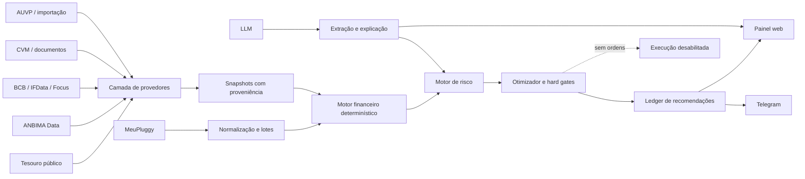

# PRD — Assessor de Renda Fixa do OpenAlice

**Produto:** OpenAlice / Alice Invest  
**Módulo:** Renda Fixa  
**Versão do PRD:** 1.0  
**Data:** 20 de agosto de 2026  
**Repositório-alvo:** `XSirch/OpenAlice`  
**Branch-base analisada:** `master`  
**Commit-base analisado:** `7675a943115ac15ab7156bd41e4ece5779dc35af`  
**Status inicial obrigatório:** `fixed_income=research_only`  
**Execução financeira:** permanentemente desabilitada no escopo deste PRD  
**Público inicial:** pessoa física residente fiscal no Brasil  
**Distribuidor/custodiante principal:** BTG Pactual  
**Origem comercial dos produtos:** AUVP Capital  
**Origem da carteira:** MeuPluggy, complementado por classificação e documentos confirmados pelo usuário  

---

## 1. Resumo executivo

O Assessor de Renda Fixa será uma seção dedicada do Alice Invest para consolidar a carteira, monitorar riscos, comparar oportunidades e recomendar como maximizar o patrimônio líquido esperado em uma data-alvo.

O sistema deverá avaliar, em uma base comparável:

- Tesouro Selic;
- Tesouro Prefixado;
- Tesouro IPCA+;
- títulos do Tesouro com juros semestrais;
- Tesouro RendA+;
- Tesouro Educa+;
- CDB e RDB;
- Letras de Câmbio;
- LCI e LCA;
- debêntures comuns;
- debêntures incentivadas;
- CRI;
- CRA.

O módulo não deverá escolher automaticamente o ativo com a maior taxa anunciada. A decisão deverá considerar retorno líquido, tributação, custos, prazo, liquidez, risco de crédito, risco de mercado, risco soberano, concentração, cobertura do FGC, qualidade e atualidade dos dados, além da compatibilidade com o objetivo financeiro.

O principal diferencial será o motor de decisão **manter versus vender versus vender parcialmente e reinvestir**. Para títulos marcados a mercado, como Tesouro IPCA+, o sistema deverá comparar os caminhos na mesma data futura, após impostos e custos. Uma valorização atual do título não será, isoladamente, motivo para vender.

O produto operará apenas como assessor analítico:

- não enviará ordens;
- não acessará endpoints de compra, venda, saque ou transferência;
- não terá botão de execução;
- poderá registrar que o usuário executou manualmente uma recomendação;
- manterá trilha auditável das premissas, fontes e resultados.

---

## 2. Decisões de produto já aprovadas

| Tema | Decisão |
|---|---|
| Universo inicial | Tesouro Direto, CDB/RDB, LC, LCI/LCA, debêntures, CRI e CRA |
| Carteira | Integração read-only existente com MeuPluggy |
| Instituição de execução | BTG Pactual |
| Curadoria/origem comercial | Produtos apresentados pela AUVP |
| Dados de mercado | ANBIMA Data e demais fontes públicas/gratuitas |
| Objetivo | Maximizar patrimônio líquido esperado na data-alvo |
| Horizontes | Mostrar vencimento original e data do objetivo |
| Perfil de risco | Configurável; moderado como padrão |
| Concentração | Limites recomendados pelo sistema e editáveis |
| Reserva de liquidez | Mínimo de 20% da carteira |
| Risco Brasil | Selic, inflação, curvas, fiscal e indicadores soberanos disponíveis |
| Crédito privado | Análise inicial, contínua e sob demanda |
| Metodologia de crédito | Score determinístico + parecer qualitativo de IA |
| Monitoramento | Diário, com reavaliação imediata de eventos críticos |
| Trocas | Exigir materialidade, confiança e qualidade de dados |
| Execução | Somente recomendar e explicar |
| Canais | Painel web + Telegram |
| Fontes | Somente públicas/gratuitas no MVP |
| Tributação | Pessoa física residente no Brasil; regras versionadas por vigência |
| Entrega | PRD funcional e técnico completo |

---

## 3. Problema

Investimentos de renda fixa são apresentados em unidades difíceis de comparar:

- percentual do CDI;
- taxa prefixada;
- IPCA mais spread;
- Selic mais spread;
- isenção ou incidência de imposto;
- liquidez diária ou vencimento;
- amortizações e cupons;
- risco de emissor;
- cobertura ou ausência do FGC;
- preço de mercado;
- custo de saída;
- disponibilidade limitada na corretora.

O investidor pode cometer erros como:

1. comparar taxa bruta de um CDB com taxa líquida de uma LCI;
2. vender um Tesouro valorizado sem medir o imposto antecipado;
3. trocar de título por uma diferença pequena consumida pelo spread;
4. comprar crédito privado com prêmio insuficiente para o risco;
5. concentrar valores acima da proteção efetiva do FGC;
6. tratar CRI ou CRA como simples risco da empresa devedora, ignorando a estrutura;
7. confiar em uma oferta que já não está disponível;
8. usar dados antigos como se fossem cotações atuais;
9. projetar taxas futuras como se fossem garantidas;
10. confundir CDI, que é um indexador, com uma classe de ativo.

O OpenAlice já possui contratos básicos de renda fixa, cálculo tributário simplificado, comparação líquida, escada de vencimentos, FGC e reconciliação com MeuPluggy. Falta transformar essas peças em um assessor completo, com precificação, risco, otimização, monitoramento e interface dedicada.

---

## 4. Visão do produto

> Um assessor read-only que acompanha a carteira de renda fixa, procura oportunidades públicas, mensura risco e mostra quando manter, vender parcialmente ou trocar um investimento produz maior patrimônio líquido esperado, sem sacrificar a reserva, ultrapassar limites de concentração ou ocultar incertezas.

### 4.1 Princípios

1. **Mesma data, mesma base:** alternativas só podem ser comparadas na mesma data-alvo e sob as mesmas premissas.
2. **Líquido antes de bruto:** impostos, IOF, taxas, spread e custos entram antes da recomendação.
3. **Risco antes da taxa:** retorno adicional deve remunerar crédito, liquidez, duration e concentração.
4. **Cálculo determinístico:** dinheiro, impostos, precificação e limites não serão calculados por LLM.
5. **IA explicativa, não soberana:** o modelo pode extrair documentos, resumir riscos e explicar resultados, mas não alterar resultados matemáticos nem ultrapassar hard gates.
6. **Proveniência obrigatória:** cada fato material deve ter fonte, data de observação e nível de confiança.
7. **Falha segura:** dado ausente, inconsistente ou vencido reduz confiança e pode impedir a recomendação.
8. **Sem execução:** nenhuma recomendação poderá virar ordem dentro deste módulo.
9. **Sem falsa precisão:** cenários e intervalos serão exibidos quando o futuro for incerto.
10. **Adequação ao objetivo:** maior retorno não substitui liquidez necessária ou prazo do usuário.

---

## 5. Objetivos

### 5.1 Objetivos funcionais

- Criar uma seção **Renda Fixa** dentro do Alice Invest.
- Consolidar posições do MeuPluggy e permitir classificação confirmada.
- Manter lotes, custo de aquisição, datas, indexador, vencimento, cupons e amortizações.
- Calcular retorno bruto, líquido, real e anualizado.
- Calcular marcação a mercado e sensibilidade a juros.
- Comparar manter, vender, vender parcialmente e reinvestir.
- Calcular taxa de equilíbrio necessária para justificar uma troca.
- Comparar oportunidades do BTG/AUVP com a carteira atual.
- Avaliar risco de bancos, empresas, debêntures, CRI e CRA.
- Monitorar indicadores macroeconômicos e eventos de crédito.
- Aplicar limites de concentração e reserva mínima de 20%.
- Exibir recomendações explicáveis no painel e no Telegram.
- Registrar recomendações, revisão humana e resultado manual.

### 5.2 Objetivos de qualidade

- Nenhuma operação de compra ou venda.
- Nenhum valor monetário calculado com `number` binário.
- Nenhuma regra fiscal sem versão e data de vigência.
- Nenhuma recomendação com fonte crítica vencida.
- Nenhuma afirmação qualitativa sem evidência citada ou indicação explícita de inferência.
- Nenhum ativo considerado disponível sem confirmação recente no BTG/AUVP.
- Nenhuma recomendação de venda baseada apenas no lucro já marcado a mercado.

### 5.3 Métricas de sucesso

| Métrica | Meta do MVP |
|---|---:|
| Recomendações com comparação na mesma data-alvo | 100% |
| Recomendações com impostos, taxas e spread discriminados | 100% |
| Recomendações com fontes e horários | 100% |
| Recomendações com score de confiança e qualidade | 100% |
| Divergência dos testes de cálculo sintético | até R$ 0,01 após regra de arredondamento |
| Divergência de preço contra referência oficial validada | até 0,10% ou limite mais estrito por produto |
| Ordens ou endpoints de execução | 0 |
| Alertas críticos duplicados | 0 por evento/idempotency key |
| Posições sem classificação exibidas como classificadas | 0 |
| Trocas que violam reserva ou concentração | 0 |
| Cobertura de testes dos módulos financeiros críticos | mínimo 90% de branches |
| Período de shadow validation antes de alertas validados | mínimo 30 dias |

---

## 6. Não objetivos

Não fazem parte do MVP:

- comprar, vender, resgatar ou transferir ativos;
- autenticar ou automatizar a área privada do BTG sem API oficial;
- contornar mecanismos de acesso da AUVP ou do BTG;
- garantir rentabilidade;
- prever Selic, inflação ou curva de juros como resultado certo;
- substituir análise jurídica de escrituras, garantias ou securitizações;
- criar rating regulatório;
- oferecer o módulo a terceiros como consultoria pública sem revisão jurídica;
- fundos, ETFs, FIDC, LIG, LF, DPGE e compromissadas no primeiro release;
- otimização tributária de pessoa jurídica;
- gestão automática discricionária;
- derivativos de hedge;
- operação no mercado secundário por API.

---

## 7. Escopo de instrumentos

### 7.1 Fase inicial

#### Tesouro Direto

- Tesouro Selic;
- Tesouro Prefixado;
- Tesouro Prefixado com juros semestrais;
- Tesouro IPCA+;
- Tesouro IPCA+ com juros semestrais;
- Tesouro RendA+;
- Tesouro Educa+.

#### Bancários

- CDB;
- RDB;
- LC;
- LCI;
- LCA.

#### Crédito privado e securitizado

- debênture comum;
- debênture incentivada;
- CRI;
- CRA.

### 7.2 Fase posterior

- Letra Financeira;
- LIG;
- DPGE;
- FIDC;
- fundos DI;
- fundos de renda fixa;
- fundos de crédito privado;
- ETFs de renda fixa;
- compromissadas;
- notas comerciais;
- outros títulos admitidos por novo contrato versionado.

### 7.3 CDI na taxonomia

CDI não será um `productType`. Será um indexador e uma área comparativa chamada **Pós-fixados / CDI**, contendo:

- histórico e nível atual;
- expectativa implícita ou cenário;
- produtos indexados ao CDI;
- equivalência entre taxa tributável e isenta;
- taxa mínima para superar uma alternativa;
- sensibilidade à trajetória de juros.

---

## 8. Personas e casos de uso

### 8.1 Persona principal

Investidor pessoa física que:

- concentra a execução no BTG Pactual;
- recebe curadoria de produtos da AUVP;
- possui carteira sincronizada pelo MeuPluggy;
- quer maximizar retorno sem perder controle de risco e liquidez;
- aceita risco moderado como padrão;
- deseja entender oportunidades de marcação a mercado;
- quer alertas, mas executará qualquer movimento manualmente.

### 8.2 Casos de uso principais

1. Ver toda a carteira de renda fixa.
2. Descobrir posições incompletas ou não classificadas.
3. Comparar uma LCI com um CDB em taxa líquida equivalente.
4. Ver exposição ao FGC por conglomerado.
5. Saber quanto da carteira está disponível em D+0/D+1.
6. Simular a venda de um Tesouro IPCA+.
7. Comparar a venda com uma nova oportunidade AUVP/BTG.
8. Descobrir a taxa mínima que torna a troca vantajosa.
9. Pedir análise de uma debênture, CRI ou CRA.
10. Receber alerta de rebaixamento, covenant, inadimplência ou deterioração.
11. Ver vencimentos e reinvestimentos futuros.
12. Direcionar novo aporte respeitando objetivos e limites.
13. Registrar manualmente que uma recomendação foi executada.
14. Medir depois se a recomendação gerou o resultado esperado.

---

## 9. Arquitetura de informação da interface

### 9.1 Navegação

Adicionar em **Alice Invest** a seção:

```text
Renda Fixa
├── Visão geral
├── Tesouro Direto
├── Pós-fixados / CDI
├── LCI e LCA
├── Debêntures
├── CRI e CRA
├── Oportunidades AUVP/BTG
├── Simular venda e reinvestimento
├── Riscos e limites
├── Agenda de vencimentos
├── Histórico de recomendações
└── Configurações
```

### 9.2 Visão geral

Exibir:

- patrimônio atual;
- valor originalmente investido;
- lucro bruto e líquido estimado;
- taxa líquida anual equivalente;
- retorno real estimado;
- reserva de liquidez atual versus meta de 20%;
- distribuição por indexador;
- distribuição por emissor e conglomerado;
- exposição coberta e descoberta pelo FGC;
- crédito privado total;
- duration da carteira;
- escada de vencimentos;
- próximas amortizações e cupons;
- recomendações abertas;
- alertas de risco;
- qualidade e atualidade das fontes.

### 9.3 Página de posição

Cada posição deverá mostrar:

- produto e código;
- emissor, devedor e conglomerado;
- origem/custodiante;
- lotes de aquisição;
- quantidade;
- preço médio;
- valor atual;
- valor bruto e líquido de resgate;
- taxa contratada;
- taxa corrente comparável;
- vencimento;
- carência e liquidez;
- fluxo de cupons e amortizações;
- imposto por lote;
- taxas e custos;
- duration, duration modificada, convexidade e DV01, quando aplicável;
- score de crédito;
- score de liquidez;
- score estrutural;
- confiança;
- documentos e fontes;
- cenários;
- comparação manter versus vender;
- taxa de equilíbrio;
- recomendação atual;
- histórico da recomendação.

### 9.4 Oportunidades AUVP/BTG

Cada oportunidade terá dois estados:

- **Indicativa:** observada em fonte pública ou importada, mas disponibilidade não confirmada recentemente.
- **Acionável manualmente:** oferta confirmada pelo usuário ou por fonte read-only autorizada, com horário, quantidade mínima e validade.

Campos:

- instituição emissora;
- distribuidor BTG;
- origem AUVP;
- tipo;
- indexador;
- taxa;
- vencimento;
- liquidez;
- aplicação mínima;
- limite disponível, quando conhecido;
- FGC;
- tributação;
- preço, PU ou ágio/deságio;
- risco;
- data/hora da observação;
- prazo de validade;
- fonte;
- resultado da comparação com a carteira.

Nenhuma oportunidade será apresentada como disponível apenas porque uma página pública foi encontrada.

---

## 10. Fluxos do usuário

### 10.1 Primeira configuração

1. O usuário abre Renda Fixa.
2. O sistema verifica MeuPluggy.
3. As posições são importadas em modo read-only.
4. Posições sem metadados suficientes ficam como `unclassified`.
5. O sistema propõe uma classificação.
6. O usuário confirma os campos relevantes.
7. O sistema solicita objetivo, data-alvo e perfil.
8. O perfil moderado e reserva de 20% são sugeridos.
9. Limites de concentração são exibidos.
10. A carteira é calculada.
11. Recomendações só são produzidas quando os dados mínimos estiverem válidos.

### 10.2 Simulação de venda e reinvestimento

1. Usuário escolhe uma posição.
2. Define percentual ou quantidade a vender.
3. Escolhe a data-alvo:
   - vencimento original;
   - data do objetivo;
   - ambas.
4. Escolhe uma oportunidade ou informa termos hipotéticos.
5. O sistema obtém preço de venda e dados de mercado.
6. Calcula imposto e custos por lote.
7. Projeta o caminho de manutenção.
8. Projeta o caminho de venda.
9. Projeta o reinvestimento.
10. Executa cenários.
11. Avalia risco e limites.
12. Exibe:
    - ganho incremental;
    - taxa mínima de equilíbrio;
    - impacto de imposto;
    - impacto de risco;
    - impacto na liquidez;
    - incerteza;
    - recomendação.
13. Usuário pode marcar como revisada ou executada manualmente.

### 10.3 Análise de crédito privado

1. Usuário escolhe ou informa debênture, CRI ou CRA.
2. O sistema resolve identificadores.
3. Busca documentos oficiais.
4. Valida a atualidade.
5. Extrai campos estruturados.
6. Calcula indicadores determinísticos.
7. Avalia emissor/devedor, estrutura e garantias.
8. Compara a taxa com a curva soberana equivalente.
9. Estima prêmio líquido ajustado a risco.
10. A IA redige parecer citando as evidências.
11. O motor aplica hard gates.
12. Resultado: `adequado`, `observar`, `evitar` ou `dados_insuficientes`.

---

## 11. Fontes de dados

### 11.1 Estratégia

O MVP usará somente fontes públicas e gratuitas. A palavra “gratuita” não implica que toda interface pública possua uma API gratuita documentada.

O sistema deverá preferir:

1. API pública oficial;
2. arquivo oficial para download;
3. página pública permitida pelos termos;
4. importação manual;
5. inferência do modelo, apenas quando rotulada e nunca para valores financeiros críticos.

É proibido:

- depender de endpoint privado não documentado;
- automatizar login sem autorização;
- contornar proteção anti-bot;
- tratar interface pública como licença irrestrita;
- ocultar a origem do dado;
- fabricar um indicador ausente.

### 11.2 Matriz de fontes

| Fonte | Uso | Frequência | Criticidade | Fallback |
|---|---|---:|---:|---|
| MeuPluggy | Custódia, valor, custo e transações disponíveis | diária e sob demanda | alta | importação manual |
| Tesouro Transparente/Tesouro Direto | taxas, preços, características e séries oficiais | dias úteis | alta | arquivo oficial armazenado |
| ANBIMA Data | preços, taxas, curvas, eventos e referências | dias úteis | alta | download manual ou fonte oficial alternativa |
| Banco Central — SGS | Selic, CDI/DI e séries macro disponíveis | diária | alta | último valor oficial válido |
| Banco Central — Focus | cenários de inflação, Selic, câmbio e PIB | semanal | média | cenários configurados |
| Banco Central — IFData | saúde de instituições financeiras | trimestral | alta para bancos | demonstrações e dados públicos |
| CVM Dados Abertos | documentos, demonstrações, ofertas e fatos | diária/eventual | alta | RI do emissor |
| Tesouro Nacional | dívida, fiscal e contexto soberano | conforme publicação | média | último dado oficial |
| FGC | política, produtos elegíveis e limites | versionada | alta | política local datada |
| B3 | calendários, índices e dados públicos aplicáveis | dias úteis | média | calendário local versionado |
| AUVP pública | catálogo/descrições indicativas | conforme disponibilidade | média | importação do usuário |
| BTG/AUVP confirmado | disponibilidade real da oferta | tempo próximo da decisão | alta | confirmação manual |
| Agente fiduciário/RI/rating | documentos de crédito | evento | alta | `dados_insuficientes` |

### 11.3 ANBIMA

Criar dois conceitos distintos:

- `AnbimaDataPublicAdapter`: consulta e downloads públicos permitidos.
- `AnbimaFeedAdapter`: fora do MVP gratuito; somente habilitável no futuro mediante credencial e licença.

A Fase 0 deverá confirmar:

- quais arquivos possuem download estável;
- quais páginas podem ser automatizadas;
- limites de uso;
- retenção permitida;
- cobertura histórica gratuita;
- horário de atualização;
- identificadores disponíveis;
- política de cache;
- esquema de versionamento.

Se a automação pública não for permitida ou confiável:

- disponibilizar importação do arquivo baixado;
- registrar origem e checksum;
- não degradar silenciosamente para scraping privado.

### 11.4 AUVP e BTG

Modelar separadamente:

```text
custodian = BTG_PACTUAL
distributor = BTG_PACTUAL
curator_or_origin = AUVP_CAPITAL
issuer = instituição ou empresa emissora
obligor = devedor do fluxo, quando aplicável
```

A fonte pública da AUVP pode ser utilizada apenas como catálogo indicativo. Para classificar uma oportunidade como acionável, exigir uma das condições:

- disponibilidade confirmada por integração read-only oficial;
- arquivo exportado do BTG/AUVP;
- oferta enviada pelo usuário;
- confirmação manual com horário e validade.

### 11.5 Proveniência

Todo fato material deverá carregar:

```ts
interface DataProvenance {
  provider: string
  sourceKind: 'official_api' | 'official_download' | 'public_page' | 'user_import' | 'custody' | 'model_inference'
  observedAt: string
  effectiveAt?: string
  publishedAt?: string
  sourceId?: string
  documentHash?: string
  schemaVersion: string
  freshnessClass: 'fresh' | 'aging' | 'stale' | 'unknown'
  qualityScore: string
  licensePolicyId: string
}
```

### 11.6 Regras de atualidade

| Dado | Fresco | Envelhecendo | Vencido |
|---|---:|---:|---:|
| Preço/taxa Tesouro | mesmo dia útil | 1 dia útil | >1 dia útil |
| ANBIMA EOD | até o próximo dia útil | 2 dias úteis | >2 dias úteis |
| Oferta AUVP/BTG | até 30 min quando confirmada | até 2 h | >2 h |
| Custódia MeuPluggy | até 24 h | 24–48 h | >48 h |
| Focus | até 10 dias | 10–17 dias | >17 dias |
| IFData | último trimestre publicado | atraso conhecido | publicação anterior à mais recente disponível |
| Demonstrações CVM | última exigível | atraso regulatório | documento subsequente não processado |
| Rating | último evento conhecido | >180 dias sem revisão | evento mais novo não processado |

Uma recomendação de venda exige que os dados críticos estejam `fresh`. Uma análise histórica pode usar dados `aging`, desde que identificados.

---

## 12. Modelo de dados

### 12.1 Instrumento

Expandir o contrato atual:

```ts
type FixedIncomeProductType =
  | 'tesouro_selic'
  | 'tesouro_prefixado'
  | 'tesouro_prefixado_coupon'
  | 'tesouro_ipca'
  | 'tesouro_ipca_coupon'
  | 'tesouro_renda_mais'
  | 'tesouro_educa_mais'
  | 'cdb'
  | 'rdb'
  | 'lc'
  | 'lci'
  | 'lca'
  | 'debenture'
  | 'debenture_incentivada'
  | 'cri'
  | 'cra'
```

### 12.2 Indexadores

```ts
type FixedIncomeRate =
  | { kind: 'fixed'; annualRatePct: DecimalString }
  | { kind: 'cdi_percentage'; cdiPct: DecimalString }
  | { kind: 'cdi_plus'; spreadPct: DecimalString }
  | { kind: 'selic_plus'; spreadPct: DecimalString }
  | { kind: 'ipca_plus'; spreadPct: DecimalString }
  | { kind: 'igpm_plus'; spreadPct: DecimalString }
  | { kind: 'custom'; label: string; methodologyId: string }
```

### 12.3 Lote

```ts
interface FixedIncomeLot {
  id: string
  positionId: string
  acquisitionDate: string
  settlementDate?: string
  quantity: DecimalString
  unitCostBRL: DecimalString
  totalCostBRL: DecimalString
  accruedFeesBRL: DecimalString
  taxLotMethod: 'explicit' | 'peps' | 'provider_reported' | 'unknown'
  source: DataProvenance
}
```

### 12.4 Fluxos

```ts
interface FixedIncomeCashFlow {
  id: string
  instrumentId: string
  date: string
  kind: 'interest' | 'coupon' | 'amortization' | 'principal' | 'premium' | 'fee'
  grossBRL: DecimalString
  indexationRuleId?: string
  taxRuleId?: string
  status: 'projected' | 'announced' | 'paid'
}
```

### 12.5 Oferta

```ts
interface FixedIncomeOpportunity {
  id: string
  instrument: FixedIncomeInstrument
  observedAt: string
  validUntil?: string
  minimumBRL?: DecimalString
  maximumAvailableBRL?: DecimalString
  priceBRL?: DecimalString
  rate: FixedIncomeRate
  liquidity: FixedIncomeLiquidity
  availability: 'indicative' | 'confirmed' | 'expired' | 'unknown'
  distributor: 'BTG_PACTUAL'
  origin: 'AUVP_CAPITAL' | 'BTG_PACTUAL' | 'USER_IMPORT'
  source: DataProvenance
}
```

### 12.6 Recomendação

```ts
type RecommendationDecision =
  | 'maintain'
  | 'watch'
  | 'sell_partial'
  | 'sell_and_reinvest'
  | 'allocate_new_cash'
  | 'review_credit'
  | 'avoid'
  | 'insufficient_data'

interface FixedIncomeRecommendation {
  id: string
  createdAt: string
  expiresAt: string
  positionId?: string
  opportunityId?: string
  decision: RecommendationDecision
  targetDate: string
  netDeltaBRL: DecimalString
  netDeltaPct: DecimalString
  annualizedNetUpliftPct: DecimalString
  confidenceScore: DecimalString
  dataQualityScore: DecimalString
  uncertaintyBRL: DecimalString
  riskBefore: RiskSummary
  riskAfter: RiskSummary
  constraintResults: ConstraintResult[]
  reasonCodes: string[]
  assumptions: Assumption[]
  sources: DataProvenance[]
  status: 'open' | 'reviewed' | 'dismissed' | 'expired' | 'manually_executed' | 'outcome_recorded'
}
```

---

## 13. Motor de cálculo

### 13.1 Requisitos gerais

- usar `Decimal`;
- representar valores por strings decimais;
- centralizar arredondamento;
- separar dias corridos e dias úteis;
- usar calendários versionados;
- registrar versão de cada metodologia;
- nunca usar LLM para cálculo;
- produzir memória de cálculo completa;
- suportar cupons, amortizações e carências;
- suportar múltiplos lotes;
- manter valores brutos, impostos, taxas e líquidos separados.

### 13.2 Tributação

Criar `TaxRuleRegistry`, com regras por:

- país;
- residência fiscal;
- tipo de investidor;
- instrumento;
- data de aquisição;
- data de resgate;
- data de vigência;
- natureza do rendimento;
- lote;
- evento de cupom ou amortização;
- isenção confirmada;
- IOF;
- regra de seleção de lotes.

Não manter a tributação como constantes permanentes no arquivo de cálculo.

Estrutura:

```ts
interface TaxRule {
  id: string
  effectiveFrom: string
  effectiveTo?: string
  investorType: 'PF_BR'
  productTypes: FixedIncomeProductType[]
  incomeTax: TaxFormula
  iof: TaxFormula
  exemptionConditions: string[]
  source: DataProvenance
}
```

Se a isenção não puder ser confirmada, o sistema deverá:

- assumir tributação conservadora para a comparação;
- marcar a premissa;
- impedir recomendação acionável até confirmação.

### 13.3 Taxas e custos

Considerar:

- custódia B3;
- taxa de administração;
- taxa de distribuição;
- taxa de entrada;
- taxa de saída;
- spread entre compra e recompra;
- ágio ou deságio;
- emolumentos aplicáveis;
- custos informados pelo BTG;
- custos já acumulados;
- custos estimados;
- arredondamentos oficiais.

O resultado deverá separar:

```text
Preço bruto de venda
- spread
- taxa de saída
- custódia
- IOF
- IR
= caixa líquido reinvestível
```

### 13.4 Retorno anualizado

Calcular:

- retorno bruto acumulado;
- retorno líquido acumulado;
- CAGR;
- XIRR para fluxos irregulares;
- retorno real;
- retorno equivalente em percentual do CDI;
- taxa bruta equivalente de produto tributável;
- taxa líquida equivalente de produto isento.

### 13.5 Precificação

Para um fluxo nominal:

```text
PV = Σ CF(t) / (1 + y(t))^(DU(t)/252)
```

Para fluxo indexado:

- atualizar VNA pela metodologia do indexador;
- aplicar defasagens e datas-base;
- projetar o índice por cenário;
- descontar cada fluxo na curva apropriada;
- aplicar convenções oficiais do instrumento.

Calcular quando aplicável:

- duration de Macaulay;
- duration modificada;
- convexidade;
- DV01;
- preço limpo;
- preço sujo;
- juros acumulados;
- ágio/deságio;
- yield to maturity;
- yield to worst;
- spread sobre curva soberana;
- spread sobre curva DI;
- spread líquido após imposto.

### 13.6 Projeções

O sistema deverá produzir:

- cenário base;
- cenário favorável;
- cenário adverso;
- cenário de estresse;
- intervalo de resultado;
- premissas;
- peso de cenário somente quando configurado;
- resultado sem probabilidade quando não houver calibração suficiente.

Não transformar Focus, curva implícita ou consenso em garantia.

---

## 14. Motor manter versus vender e reinvestir

### 14.1 Princípio central

A comparação será feita na mesma data-alvo.

```text
Δ(H) = Patrimônio líquido da troca em H
     - Patrimônio líquido da manutenção em H
```

A data `H` será:

- vencimento original;
- data do objetivo;
- ambas, conforme solicitado.

### 14.2 Caminho manter

Incluir:

- cupons;
- amortizações;
- reinvestimento dos fluxos;
- vencimento;
- imposto por evento;
- custos futuros;
- venda na data-alvo se ela anteceder o vencimento;
- reinvestimento depois do vencimento se a data-alvo for posterior;
- risco de crédito e cenários.

### 14.3 Caminho vender

Incluir:

- preço realista de recompra;
- spread;
- impostos por lote;
- custo de saída;
- custódia acumulada;
- caixa líquido;
- liquidação;
- dias sem remuneração;
- validade da cotação.

### 14.4 Caminho reinvestir

Incluir:

- disponibilidade confirmada;
- aplicação mínima;
- prazo;
- taxa;
- tributação;
- FGC;
- risco;
- liquidez;
- vencimentos intermediários;
- reinvestimentos;
- custos.

### 14.5 Taxa de equilíbrio

O sistema deverá resolver a taxa `r*` que satisfaça:

```text
FV_reinvestimento(caixa_líquido, r*, H) = FV_manutenção(H)
```

Mostrar:

- taxa bruta de equilíbrio;
- taxa líquida de equilíbrio;
- percentual do CDI equivalente;
- spread sobre IPCA ou Selic;
- ganho sobre a oferta;
- margem de segurança.

### 14.6 Invariante contra falsa arbitragem

Teste obrigatório:

> Vender um título e recomprar imediatamente o mesmo título, com as mesmas condições, não pode produzir patrimônio final superior ao caminho de manutenção depois de imposto, spread e custos.

Se o cálculo indicar vantagem, o pipeline deve falhar e registrar erro de metodologia ou dados.

### 14.7 Venda parcial

Testar percentuais candidatos:

- mínimo negociável;
- 10%;
- 25%;
- 50%;
- 75%;
- 100%;
- ponto ótimo calculado.

Recomendar venda parcial quando:

- a troca total violar concentração;
- a troca total reduzir reserva abaixo de 20%;
- a oportunidade tiver limite;
- o ganho marginal cair com o tamanho;
- a exposição atual precisar ser rebalanceada.

---

## 15. Função de otimização

### 15.1 Objetivo

```text
Maximizar:
E[PatrimônioLíquido(H)]
- PenalidadeRisco
- PenalidadeLiquidez
- PenalidadeConcentração
- PenalidadeIncerteza
- CustosDeTroca
```

Sujeito a:

- reserva de liquidez mínima de 20%;
- limites do perfil;
- vencimentos compatíveis com o objetivo;
- disponibilidade do produto;
- investimento mínimo;
- cobertura FGC;
- qualidade de dados;
- proibição de execução;
- restrições definidas pelo usuário.

### 15.2 Método do MVP

Usar otimização determinística por cenários e busca discreta, não um modelo opaco.

1. Gerar alternativas elegíveis.
2. Calcular fluxos e patrimônio em cada cenário.
3. Aplicar hard gates.
4. Calcular penalidades.
5. Ordenar por utilidade.
6. Exibir resultado financeiro bruto e resultado ajustado.
7. Explicar por que alternativas foram eliminadas.

### 15.3 Resultado

Não retornar apenas um ranking. Retornar:

- melhor alternativa;
- melhor alternativa de menor risco;
- manutenção;
- diferença;
- sensibilidade;
- restrições ativas;
- alternativas rejeitadas;
- razões de rejeição.

---

## 16. Perfil de risco e limites

### 16.1 Perfis

| Regra | Conservador | Moderado padrão | Agressivo |
|---|---:|---:|---:|
| Reserva D+0/D+1 | 30% | 20% | 10% |
| Crédito privado total | 20% | 35% | 50% |
| Ativos ilíquidos | 25% | 40% | 60% |
| Nota mínima de crédito | 75 | 65 | 55 |
| Confiança mínima | 85% | 80% | 75% |
| Prazo acima de 5 anos | 25% | 35% | 50% |

O usuário poderá alterar cada limite por objetivo.

### 16.2 Limites recomendados para o perfil moderado

- reserva líquida: mínimo 20%;
- FGC por conglomerado: menor entre 15% da carteira e R$ 225.000;
- emissor corporativo individual: 5%;
- emissor de alta qualidade com garantias robustas: até 7,5%, mediante override explícito;
- série individual de CRI/CRA: 3%;
- devedor ou grupo econômico em crédito privado: 5%;
- crédito privado total: 35%;
- ativos sem liquidez diária: 40%;
- setor econômico: 20%;
- vencimentos acima de cinco anos: 35%;
- posição com score abaixo do mínimo: 0% para novas alocações;
- posição já detida abaixo do mínimo: `review_credit`, não venda automática.

O limite de R$ 225.000 deixa margem para rendimentos dentro do teto nominal do FGC. A política deverá ser versionada e atualizável.

### 16.3 Hard gates

Impedir recomendação de compra/troca quando:

- reserva fica abaixo do mínimo;
- concentração excede limite;
- FGC é necessário, mas elegibilidade não está confirmada;
- oferta está vencida;
- dado crítico está vencido;
- rating ou demonstração mais recente não foi processado;
- há evento de inadimplência não resolvido;
- o produto não cabe no objetivo;
- score está abaixo do mínimo;
- confiança está abaixo do mínimo;
- documentação estrutural é insuficiente;
- taxa não cobre o prêmio mínimo requerido.

---

## 17. Limites de materialidade das recomendações

### 17.1 Padrões aprovados

Uma recomendação de troca exigirá simultaneamente:

```text
ganho líquido incremental >= máximo(R$ 100, 0,25% da posição)
ganho líquido percentual >= 0,50% no horizonte
uplift líquido anualizado >= 0,50 ponto percentual
confidenceScore >= 0,80
dataQualityScore >= 0,85
benefício / incerteza >= 2,0
```

Também deverá:

- respeitar reserva e concentração;
- não elevar o risco além do perfil;
- usar oferta válida;
- ter cálculo reproduzível;
- passar todos os hard gates.

### 17.2 Estados

- vantagem negativa: `maintain`;
- vantagem positiva abaixo da materialidade: `watch`;
- vantagem material, mas dados insuficientes: `insufficient_data`;
- vantagem material com restrição de tamanho: `sell_partial`;
- vantagem material e todos os gates aprovados: `sell_and_reinvest`;
- deterioração de crédito: `review_credit`;
- nova oferta incompatível: `avoid`.

### 17.3 Cooldown

- 30 dias para repetir a mesma recomendação;
- ignorar cooldown diante de evento crítico;
- novo alerta quando a diferença mudar materialmente;
- deduplicar por posição, alternativa, horizonte e versão das premissas.

---

## 18. Risco soberano e macroeconômico

### 18.1 Objetivo

Definir o retorno mínimo exigido e os cenários de juros e inflação, sem produzir uma falsa previsão única.

### 18.2 Componentes

- Selic;
- CDI/DI;
- curva nominal;
- curva real;
- inclinação;
- inflação corrente;
- expectativas de inflação;
- dispersão das expectativas;
- dívida pública;
- resultado fiscal;
- risco soberano disponível;
- CDS ou EMBI quando houver fonte gratuita confiável;
- volatilidade;
- eventos fiscais e monetários.

### 18.3 Score de regime macro

Criar score de 0 a 100, com versão:

| Componente | Peso |
|---|---:|
| Nível e inclinação das curvas | 25% |
| Inflação e desancoragem | 20% |
| Política monetária e Focus | 15% |
| Fiscal e dívida | 20% |
| Risco soberano disponível | 10% |
| Volatilidade e liquidez | 10% |

Se CDS/EMBI não estiver disponível gratuitamente:

- não estimar valor;
- redistribuir peso conforme política versionada ou reduzir confiança;
- indicar lacuna.

### 18.4 Aplicação

O score não deverá decidir sozinho. Ele será usado para:

- criar cenários;
- definir prêmio mínimo;
- aumentar penalidade de duration;
- detectar concentração em indexadores;
- explicar sensibilidade;
- priorizar monitoramento.

---

## 19. Avaliação de instituições financeiras

### 19.1 Fontes

- IFData;
- demonstrações oficiais;
- fatos regulatórios;
- ratings;
- FGC;
- notícias oficiais;
- documentos do emissor.

### 19.2 Indicadores

- capital principal;
- índice de Basileia;
- liquidez;
- inadimplência;
- cobertura de provisões;
- crescimento da carteira;
- concentração de funding;
- rentabilidade;
- eficiência;
- ativos problemáticos;
- alavancagem;
- intervenção ou restrição regulatória;
- conglomerado;
- cobertura efetiva do FGC.

### 19.3 Scores separados

- `intrinsicCreditScore`;
- `liquidityScore`;
- `regulatoryScore`;
- `fgcProtectionScore`;
- `dataConfidenceScore`.

O FGC não deve transformar uma instituição frágil em instituição de alta qualidade. Ele é uma camada de proteção separada.

---

## 20. Avaliação de debêntures

### 20.1 Emissor

Analisar:

- receita;
- margem;
- EBITDA;
- fluxo de caixa operacional;
- geração de caixa livre;
- dívida líquida/EBITDA;
- cobertura de juros;
- dívida de curto prazo;
- liquidez corrente;
- cronograma de dívida;
- exposição cambial;
- concentração de clientes;
- setor;
- governança;
- contingências;
- auditor;
- histórico de pagamento;
- fatos relevantes;
- rating e alterações.

### 20.2 Instrumento

Analisar:

- escritura;
- série;
- senioridade;
- subordinação;
- garantias;
- covenants;
- headroom dos covenants;
- amortizações;
- cupons;
- possibilidade de resgate antecipado;
- vencimento antecipado;
- waiver;
- agente fiduciário;
- eventos de crédito;
- liquidez no secundário;
- duration;
- preço;
- spread.

### 20.3 Métrica de valor

```text
Prêmio líquido ajustado =
yield líquido do título
- yield líquido soberano comparável
- perda esperada
- prêmio de liquidez
- penalidade de concentração
- margem de incerteza
```

Perda esperada deverá ser apresentada como intervalo quando PD e LGD não forem calibráveis.

---

## 21. Avaliação de CRI e CRA

### 21.1 Regra

A saúde da empresa devedora é necessária, mas não suficiente.

### 21.2 Elementos

- securitizadora;
- devedor/cedente;
- lastro;
- pulverização;
- concentração;
- adimplência;
- histórico de atraso;
- garantias;
- subordinação;
- overcollateralization;
- conta reserva;
- waterfall;
- gatilhos;
- pré-pagamento;
- substituição de recebíveis;
- servicer;
- agente fiduciário;
- auditoria;
- coobrigação;
- risco jurídico;
- tranche;
- rating;
- duration;
- liquidez;
- eventos do lastro.

### 21.3 Resultado

Produzir scores separados:

- devedor;
- lastro;
- estrutura;
- garantias;
- liquidez;
- documentação;
- confiança.

Um ativo com boa empresa, mas estrutura frágil, não poderá receber score alto apenas pelo nome do devedor.

---

## 22. Score determinístico e parecer de IA

### 22.1 Divisão de responsabilidades

#### Motor determinístico

- cálculos;
- indicadores;
- limites;
- notas;
- gates;
- cenários;
- comparação;
- ranking;
- incerteza;
- proveniência.

#### IA

- identificar documentos;
- extrair texto;
- mapear cláusulas;
- resumir riscos;
- comparar versões de documentos;
- explicar resultado;
- levantar perguntas;
- classificar evento qualitativo com evidências.

### 22.2 Restrições da IA

A IA não poderá:

- alterar score;
- criar taxa;
- inferir FGC pelo nome;
- declarar garantia sem documento;
- preencher valor ausente sem marcação;
- recomendar quando hard gate falhou;
- esconder conflito entre fontes;
- tratar inferência como fato.

### 22.3 Parecer

Formato:

```text
Resumo executivo
Pontos favoráveis
Pontos de atenção
Riscos críticos
Estrutura e garantias
Indicadores
Prêmio contra referência
Cenários
Lacunas de dados
Conclusão do motor
Explicação da IA
Fontes
```

---

## 23. Monitoramento

### 23.1 Frequências

- custódia MeuPluggy: diária e sob demanda;
- Tesouro e curvas: dias úteis;
- ANBIMA EOD: após publicação;
- Focus: semanal;
- IFData: a cada nova publicação;
- CVM e fatos: diariamente;
- documentos de agente fiduciário: diariamente;
- notícias/eventos: várias vezes ao dia;
- ofertas: sob demanda e durante janela permitida;
- carteira completa: reavaliação diária.

### 23.2 Eventos críticos

- atraso de pagamento;
- inadimplência;
- recuperação judicial;
- vencimento antecipado;
- quebra de covenant;
- waiver;
- rebaixamento;
- retirada de rating;
- mudança de garantia;
- deterioração financeira;
- intervenção regulatória;
- mudança tributária;
- alteração de liquidez;
- pré-pagamento;
- recompra;
- resgate antecipado;
- oferta de troca;
- queda ou alta relevante de preço;
- mudança material na curva;
- oportunidade com ganho material.

### 23.3 Reação

1. registrar evento;
2. resolver entidades afetadas;
3. invalidar análises antigas;
4. atualizar dados;
5. recalcular risco;
6. recalcular recomendação;
7. aplicar deduplicação;
8. enviar alerta, se habilitado;
9. manter trilha auditável.

### 23.4 Falha segura

- provider fora do ar: usar cache somente para visão histórica;
- preço vencido: não recomendar venda;
- documento incompleto: `insufficient_data`;
- divergência entre fontes: exibir e bloquear;
- monitor atrasado: registrar gap;
- erro de cálculo: não emitir recomendação.

---

## 24. Telegram

### 24.1 Menu

```text
/renda_fixa
├── Resumo da carteira
├── Tesouro Direto
├── Pós-fixados / CDI
├── LCI e LCA
├── Debêntures
├── CRI e CRA
├── Oportunidades
├── Simular troca
├── Alertas
└── Limites
```

### 24.2 Mensagem de recomendação

```text
RENDA FIXA — VENDER PARCIALMENTE

Posição: Tesouro IPCA+ 2031
Parcela analisada: 50%
Alternativa: LCA prefixada — BTG/AUVP
Horizonte: 20/08/2031

Ganho líquido incremental: R$ 12.319,44
Ganho no horizonte: 13,56%
Uplift anualizado: 2,58 p.p.
IR antecipado: R$ 2.250,00
Custos estimados: R$ 130,00

Risco: estável → menor
Liquidez: piora moderada
Reserva após troca: 23,1%
Confiança: 88%
Dados: atualizados

Motivos:
1. ganho supera materialidade;
2. FGC confirmado e com margem;
3. oferta cabe no objetivo;
4. reserva e concentração preservadas.

[Ver cálculo] [Marcar como revisada] [Silenciar]
```

Não incluir botão de comprar, vender, aprovar ordem ou executar.

### 24.3 Digest

Digest diário contendo:

- resumo;
- mudanças relevantes;
- alertas;
- vencimentos;
- ofertas observadas;
- recomendações novas;
- dados vencidos;
- ações manuais necessárias.

---

## 25. API web

### 25.1 Endpoints

```text
GET    /api/alice-invest/fixed-income/overview
GET    /api/alice-invest/fixed-income/positions
GET    /api/alice-invest/fixed-income/positions/:id
GET    /api/alice-invest/fixed-income/opportunities
GET    /api/alice-invest/fixed-income/recommendations
GET    /api/alice-invest/fixed-income/recommendations/:id
POST   /api/alice-invest/fixed-income/simulations/switch
POST   /api/alice-invest/fixed-income/simulations/invest
POST   /api/alice-invest/fixed-income/credit-analysis
POST   /api/alice-invest/fixed-income/refresh
POST   /api/alice-invest/fixed-income/imports
PATCH  /api/alice-invest/fixed-income/policy
POST   /api/alice-invest/fixed-income/recommendations/:id/review
POST   /api/alice-invest/fixed-income/recommendations/:id/manual-outcome
```

### 25.2 Proibições

Não criar:

```text
POST /orders
POST /buy
POST /sell
POST /redeem
POST /transfer
POST /approve-trade
```

### 25.3 Simulação de troca

Entrada:

```json
{
  "positionId": "string",
  "sellFraction": "0.50",
  "targetDates": ["2031-08-20"],
  "replacementOpportunityId": "string",
  "scenarioSetId": "moderate-default-v1"
}
```

Saída:

```json
{
  "decision": "sell_partial",
  "hold": {},
  "sell": {},
  "reinvest": {},
  "delta": {},
  "breakEven": {},
  "riskDelta": {},
  "constraints": [],
  "confidence": "0.88",
  "dataQuality": "0.91",
  "sources": [],
  "calculationTraceId": "string"
}
```

---

## 26. Ferramentas para agentes

Criar:

- `aliceInvestFixedIncomeOverview`;
- `aliceInvestFixedIncomePositionDetail`;
- `aliceInvestSimulateFixedIncomeSwitch`;
- `aliceInvestCompareFixedIncomeOpportunities`;
- `aliceInvestAnalyzePrivateCredit`;
- `aliceInvestExplainFixedIncomeRecommendation`;
- `aliceInvestListUnclassifiedFixedIncome`;
- `aliceInvestProposeFixedIncomeClassification`;
- `aliceInvestConfirmFixedIncomeClassification`;
- `aliceInvestRecordManualRecommendationOutcome`.

Ferramentas de mutação poderão alterar apenas:

- classificação confirmada;
- política;
- objetivo;
- status de revisão;
- resultado manual.

Nenhuma ferramenta terá acesso ao UTA ou broker write path.

---

## 27. Arquitetura técnica proposta

### 27.1 Reuso

Reutilizar:

- contratos de renda fixa;
- `Decimal`;
- reconciliação MeuPluggy;
- classificação confirmada;
- cálculo de FGC;
- escada de vencimentos;
- readiness;
- kill switches;
- monitor supervisionado;
- ledger e idempotência;
- trilha de telemetria;
- Hono;
- React;
- Vitest;
- armazenamento file-based.

### 27.2 Refatoração

- transformar `calculations.ts` em motores separados de fluxo, imposto e taxa;
- substituir comparação simples por comparador ajustado ao risco;
- ampliar contratos sem quebrar migrações;
- manter compatibilidade com posições classificadas atuais;
- remover regras tributárias permanentes do código central;
- adicionar proveniência em todos os resultados.

### 27.3 Estrutura sugerida

```text
src/domain/alice-invest/fixed-income/
├── contracts.ts
├── instruments.ts
├── lots.ts
├── cashflows.ts
├── calendars.ts
├── tax-rules.ts
├── fees.ts
├── projections.ts
├── xirr.ts
├── equivalence.ts
├── duration.ts
├── break-even.ts
├── switch-analysis.ts
├── optimizer.ts
├── constraints.ts
├── uncertainty.ts
├── recommendations.ts
├── reconciliation.ts
├── fgc.ts
├── ladder.ts
├── pricing/
│   ├── treasury.ts
│   ├── bank-products.ts
│   └── private-credit.ts
├── risk/
│   ├── contracts.ts
│   ├── country-risk.ts
│   ├── bank-score.ts
│   ├── corporate-score.ts
│   ├── securitization-score.ts
│   ├── liquidity-score.ts
│   └── score-policy.ts
├── providers/
│   ├── provider-contract.ts
│   ├── tesouro-transparente.ts
│   ├── anbima-data-public.ts
│   ├── bcb-sgs.ts
│   ├── bcb-focus.ts
│   ├── bcb-ifdata.ts
│   ├── cvm-open-data.ts
│   ├── fgc-policy.ts
│   ├── auvp-public.ts
│   └── manual-import.ts
└── monitor/
    ├── fixed-income-monitor-service.ts
    ├── monitor-runner.ts
    ├── event-store.ts
    └── delivery-store.ts
```

Adicionar:

```text
src/tool/alice-invest-fixed-income.ts
src/webui/routes/fixed-income.ts
ui/src/pages/FixedIncomePage.tsx
ui/src/api/fixed-income.ts
ui/src/components/fixed-income/*
```

### 27.4 Diagrama



---

## 28. Persistência

### 28.1 Estratégia

Manter o padrão file-based do projeto no MVP.

### 28.2 Arquivos

```text
data/state/fixed-income-policy.json
data/state/fixed-income-goals.json
data/state/fixed-income-classifications.json
data/state/fixed-income-recommendations.jsonl
data/state/fixed-income-credit-analyses.jsonl
data/state/fixed-income-monitor-events.jsonl
data/state/fixed-income-manual-outcomes.jsonl
data/market-data/fixed-income/YYYY-MM-DD/*.json.gz
data/imports/fixed-income/*
data/artifacts/fixed-income/*
```

### 28.3 Requisitos

- permissões privadas;
- escrita atômica;
- journal append-only;
- checksum;
- migração idempotente;
- retenção configurável;
- compactação;
- rotação;
- recuperação após reinício;
- nenhum segredo nos snapshots;
- IDs externos redigidos na API;
- cálculo reproduzível por `calculationTraceId`.

### 28.4 Migração

Criar migração versionada, por exemplo:

```text
0028_alice_invest_fixed_income_advisor
```

A migração deverá:

- preservar definições existentes;
- converter `tesouro_direto` genérico quando possível;
- manter genérico quando não houver evidência;
- criar políticas padrão;
- criar reserva de 20%;
- não produzir recomendações durante migração;
- manter readiness `research_only`.

---

## 29. Configuração

Expandir a configuração:

```ts
interface FixedIncomeAdvisorPolicy {
  version: 1
  enabled: boolean
  defaultRiskProfile: 'moderate'
  liquidityReservePct: '20'
  concentrationLimits: ConcentrationLimits
  recommendationThresholds: RecommendationThresholds
  providerPolicies: ProviderPolicy[]
  taxPolicyId: string
  scenarioPolicyId: string
  notificationPolicy: NotificationPolicy
  executionEnabled: false
}
```

Kill switches:

```text
fixed_income_provider_refresh_enabled
fixed_income_opportunity_scan_enabled
fixed_income_credit_monitor_enabled
fixed_income_recommendation_generation_enabled
fixed_income_notifications_enabled
```

Todos deverão iniciar em `false` ou estado fail-closed até validação.

---

## 30. Segurança, privacidade e auditoria

### 30.1 Segurança

- integração MeuPluggy read-only;
- nenhum escopo de pagamento;
- nenhum token em log;
- secrets no vault existente;
- arquivos privados;
- limites de tamanho;
- proteção contra path traversal;
- validação Zod strict;
- timeout;
- retry limitado;
- circuit breaker;
- sanitização de documentos;
- proteção contra prompt injection em PDFs e páginas;
- isolamento entre extração de conteúdo e comandos;
- allowlist de domínios oficiais;
- nenhuma navegação autenticada automática.

### 30.2 Prompt injection

Todo conteúdo externo deverá ser tratado como dado não confiável.

O pipeline de documentos:

1. baixa ou recebe arquivo;
2. calcula hash;
3. valida tipo;
4. extrai texto;
5. remove scripts;
6. separa instruções de conteúdo;
7. utiliza schema de extração;
8. valida campos;
9. exige fonte;
10. não permite chamada de ferramenta por instrução contida no documento.

### 30.3 Auditoria

Registrar:

- versão do código;
- versão da política;
- fontes;
- timestamps;
- dados de entrada;
- arredondamento;
- resultado por etapa;
- gates;
- recomendação;
- mensagem exibida;
- revisão;
- resultado manual.

### 30.4 Uso por terceiros

Antes de transformar o módulo pessoal em serviço para terceiros, exigir revisão jurídica sobre:

- consultoria;
- suitability;
- distribuição;
- publicidade;
- responsabilidade;
- tratamento de dados;
- termos de uso;
- regras CVM, ANBIMA e LGPD.

---

## 31. Observabilidade

### 31.1 Métricas

- refresh por provedor;
- latência;
- erro;
- cache hit;
- idade dos dados;
- divergência entre fontes;
- posições sem classificação;
- lotes incompletos;
- recomendações por estado;
- recomendações bloqueadas;
- alertas;
- duplicatas evitadas;
- drift de score;
- diferença entre resultado projetado e manual;
- uso de fallback;
- gaps do monitor.

### 31.2 Health

```text
GET /api/alice-invest/fixed-income/health
```

Por provedor:

- status;
- último sucesso;
- última tentativa;
- atraso;
- cobertura;
- qualidade;
- circuit breaker;
- erro redigido.

### 31.3 Logs

Nunca registrar:

- saldo completo em log geral;
- CPF;
- token;
- itemId completo;
- documento integral;
- identificador de conta;
- conteúdo de Telegram.

---

## 32. Critérios de aceitação funcionais

### 32.1 Carteira

- importa posições do MeuPluggy;
- exibe posições não classificadas;
- não infere FGC;
- permite classificação confirmada;
- mantém lotes quando disponíveis;
- mostra lacunas;
- calcula reserva;
- agrega por conglomerado.

### 32.2 Comparação

- usa mesma data-alvo;
- discrimina impostos;
- discrimina custos;
- calcula taxa de equilíbrio;
- calcula cenários;
- calcula risco antes/depois;
- aplica limites;
- mostra incerteza;
- impede troca sem dados frescos.

### 32.3 Crédito

- obtém documentos;
- calcula score determinístico;
- gera parecer com fontes;
- separa empresa e estrutura;
- detecta evento crítico;
- não recomenda quando documentação é insuficiente.

### 32.4 Interface

- possui todas as subseções;
- funciona responsivamente;
- exibe loading, empty, stale e error;
- não possui botão de ordem;
- permite registrar execução manual;
- mostra memória de cálculo.

### 32.5 Telegram

- recebe comando;
- responde com resumo;
- envia alertas idempotentes;
- não oferece execução;
- respeita kill switches;
- redige dados sensíveis.

---

## 33. Caso sintético de aceitação — Tesouro IPCA+

> Caso fictício para testar o motor. Não representa cotação ou recomendação real.

### 33.1 Posição

| Campo | Valor |
|---|---:|
| Título | Tesouro IPCA+ sem juros semestrais 2031 |
| Compra | 20/08/2024 |
| Liquidação | 21/08/2024 |
| Vencimento/data-alvo | 20/08/2031 |
| Investido | R$ 100.000,00 |
| Taxa contratada | IPCA + 6,00% a.a. |
| Data da decisão | 20/08/2026 |
| Preço bruto de venda | R$ 130.000,00 |
| Ganho realizado | R$ 30.000,00 |
| IR sintético | R$ 4.500,00 |
| Custos de saída | R$ 260,00 |
| Caixa líquido | R$ 125.240,00 |

### 33.2 Caminho manter

Premissa sintética de IPCA: 4,00% a.a.

```text
Valor bruto no vencimento:
R$ 100.000 × [(1 + 4%) × (1 + 6%)]^7
= R$ 197.867,48

IR sintético:
15% × (R$ 197.867,48 - R$ 100.000)
= R$ 14.680,12

Custódia total sintética:
R$ 1.500,00

Patrimônio líquido:
R$ 181.687,36
```

### 33.3 Caminho vender e reinvestir

Oportunidade fictícia:

| Campo | Valor |
|---|---:|
| Produto | LCA prefixada |
| Distribuidor | BTG Pactual |
| Origem | AUVP |
| Taxa | 10,50% a.a. |
| Prazo | 5 anos |
| Vencimento | 20/08/2031 |
| Tributação | isenta no cenário do teste |
| FGC | confirmado, dentro do limite |
| Score do emissor | 82/100 |
| Disponibilidade | confirmada |
| Custos | zero no fixture |

```text
R$ 125.240 × (1 + 10,5%)^5
= R$ 206.326,23
```

### 33.4 Resultado

```text
Ganho incremental:
R$ 206.326,23 - R$ 181.687,36
= R$ 24.638,87

Uplift anualizado aproximado:
2,576% a.a.
```

Resultado esperado:

```text
decision = sell_and_reinvest
```

Somente se:

- oferta estiver válida;
- FGC estiver confirmado;
- reserva permanecer >=20%;
- concentração permanecer válida;
- qualidade >=85%;
- confiança >=80%;
- benefício/incerteza >=2;
- cálculos oficiais completos confirmarem o fixture.

### 33.5 Controle de falsa arbitragem

Simular venda e recompra imediata do mesmo Tesouro.

Resultado obrigatório:

```text
FV_vender_e_recomprar <= FV_manter
decision = maintain
```

A diferença deverá refletir imposto antecipado, spread e custos.

### 33.6 Crédito de alta taxa, risco insuficiente

Oferta fictícia:

- debênture a 16,50% a.a.;
- soberano comparável a 12,80% a.a.;
- score de crédito 48;
- covenant apertado;
- liquidez desconhecida;
- demonstração atrasada.

Resultado:

```text
decision = avoid
```

A taxa maior não poderá superar os hard gates.

### 33.7 Concentração FGC

- carteira já possui R$ 220.000 no conglomerado;
- nova LCI exige R$ 50.000;
- limite moderado interno: R$ 225.000.

Resultado:

- alocação integral rejeitada;
- máximo elegível de R$ 5.000, se aplicação mínima permitir;
- caso contrário, `avoid`;
- sugerir outro conglomerado.

### 33.8 Reserva

- carteira total: R$ 600.000;
- liquidez atual: R$ 125.000;
- troca reduz liquidez para R$ 110.000.

Resultado:

```text
reserva pós-troca = 18,33%
hard gate = failed
decision != sell_and_reinvest
```

---

## 34. Testes

### 34.1 Unitários

- IR em todas as fronteiras;
- IOF do dia 0 ao 30;
- ano bissexto;
- 252 dias úteis;
- feriados;
- cupons;
- amortização;
- carência;
- prefixado;
- CDI;
- CDI + spread;
- IPCA + spread;
- equivalência isento/tributado;
- XIRR;
- duration;
- convexidade;
- DV01;
- FGC;
- conglomerado;
- limites;
- venda parcial;
- taxa de equilíbrio;
- rounding;
- dados ausentes;
- fonte vencida.

### 34.2 Propriedade

- patrimônio nunca vira `NaN`;
- imposto não é negativo;
- caixa líquido não excede bruto sem crédito explícito;
- aumentar custo não aumenta retorno;
- reduzir taxa de reinvestimento não aumenta valor final;
- vender e recomprar o mesmo título não gera arbitragem;
- posição maior não reduz concentração;
- fonte mais antiga não aumenta confiança;
- ausência de FGC não vira elegível;
- hard gate falho não gera recomendação acionável.

### 34.3 Golden tests

- dados oficiais do Tesouro;
- exemplos oficiais de tributação;
- downloads públicos da ANBIMA;
- políticas do FGC;
- fixture MeuPluggy redigido;
- demonstração de banco;
- debênture;
- CRI;
- CRA;
- caso com cupom;
- caso com amortização.

### 34.4 Integração

- provider → snapshot;
- snapshot → normalização;
- MeuPluggy → reconciliação;
- documentos → extração;
- cálculos → recomendação;
- recomendação → API;
- API → UI;
- ledger → Telegram;
- reinício → recuperação;
- outage → fail-safe.

### 34.5 Segurança

- prompt injection;
- path traversal;
- arquivo malformado;
- zip bomb;
- HTML com script;
- documento excessivo;
- segredo em erro;
- ID externo em API;
- endpoint de execução inexistente;
- UTA não referenciado pelos tools.

### 34.6 CI

Adicionar matriz específica:

```text
typecheck
fixed-income-unit
fixed-income-golden
fixed-income-provider-contracts
fixed-income-security
fixed-income-ui
fixed-income-no-execution
docker-smoke
```

---

## 35. Fases de implementação

### Fase 0 — Viabilidade de dados

- validar termos e downloads da ANBIMA;
- identificar endpoints oficiais gratuitos;
- mapear cobertura;
- validar Tesouro Transparente;
- validar BCB, IFData e CVM;
- avaliar catálogo público AUVP;
- definir importação BTG/AUVP;
- obter fixture MeuPluggy redigido;
- documentar licenças;
- criar provider contract.

**Saída:** matriz de fonte aprovada, sem scraping privado.

### Fase 1 — Núcleo financeiro

- novos contratos;
- lotes;
- fluxos;
- calendário;
- impostos versionados;
- taxas;
- XIRR;
- equivalências;
- migração;
- testes.

**Saída:** carteira líquida correta, ainda sem recomendação.

### Fase 2 — Tesouro e marcação a mercado

- provider oficial;
- precificação;
- VNA;
- duration;
- cenários;
- manter/vender;
- break-even;
- controle de falsa arbitragem.

**Saída:** simulador validado.

### Fase 3 — Bancários e oportunidades

- CDB/RDB/LC/LCI/LCA;
- FGC;
- IFData;
- equivalência;
- importação de ofertas;
- disponibilidade;
- limites;
- otimização de novo aporte.

**Saída:** ranking líquido ajustado a risco.

### Fase 4 — Crédito privado

- CVM;
- ANBIMA;
- documentos;
- debêntures;
- CRI/CRA;
- scores;
- parecer de IA;
- eventos.

**Saída:** análise inicial e contínua.

### Fase 5 — Interface e Telegram

- navegação;
- dashboard;
- detalhes;
- simulação;
- histórico;
- alertas;
- digest;
- revisão manual.

**Saída:** experiência completa, ainda `research_only`.

### Fase 6 — Shadow validation

- 30 dias;
- dados reais read-only;
- comparar cálculos;
- medir alertas;
- revisar falsos positivos;
- ajustar thresholds;
- gerar relatório;
- aprovar evidências.

**Saída:** possibilidade de `paper_alerts`, nunca execução.

---

## 36. Backlog por épico

### E0 — Dados e licenças

- E0.1 inventariar fontes;
- E0.2 registrar termos;
- E0.3 criar contrato de provider;
- E0.4 adaptar Tesouro;
- E0.5 adaptar BCB;
- E0.6 adaptar IFData;
- E0.7 adaptar CVM;
- E0.8 adaptar ANBIMA pública;
- E0.9 avaliar AUVP pública;
- E0.10 criar importação manual;
- E0.11 implementar provenance;
- E0.12 implementar freshness.

### E1 — Domínio

- E1.1 ampliar product types;
- E1.2 ampliar indexadores;
- E1.3 criar lotes;
- E1.4 criar fluxos;
- E1.5 criar ofertas;
- E1.6 criar objetivos;
- E1.7 criar política;
- E1.8 criar recomendações;
- E1.9 criar migração;
- E1.10 compatibilidade retroativa.

### E2 — Financeiro

- E2.1 calendário;
- E2.2 imposto versionado;
- E2.3 IOF;
- E2.4 taxas;
- E2.5 cash flows;
- E2.6 XIRR;
- E2.7 retorno real;
- E2.8 equivalência;
- E2.9 rounding;
- E2.10 memória de cálculo.

### E3 — Tesouro

- E3.1 catálogo;
- E3.2 preços;
- E3.3 taxas;
- E3.4 VNA;
- E3.5 cupons;
- E3.6 precificação;
- E3.7 duration;
- E3.8 convexidade;
- E3.9 DV01;
- E3.10 venda líquida;
- E3.11 cenários;
- E3.12 golden tests.

### E4 — Troca e otimização

- E4.1 hold path;
- E4.2 sell path;
- E4.3 reinvest path;
- E4.4 break-even;
- E4.5 materialidade;
- E4.6 incerteza;
- E4.7 venda parcial;
- E4.8 constraints;
- E4.9 optimizer;
- E4.10 reason codes;
- E4.11 falsa arbitragem.

### E5 — Bancos e FGC

- E5.1 IFData;
- E5.2 score bancário;
- E5.3 conglomerados;
- E5.4 FGC versionado;
- E5.5 margem de cobertura;
- E5.6 CDB/RDB;
- E5.7 LC;
- E5.8 LCI/LCA;
- E5.9 risco/retorno;
- E5.10 testes.

### E6 — Debêntures

- E6.1 resolver emissor;
- E6.2 demonstrações;
- E6.3 escritura;
- E6.4 covenants;
- E6.5 garantias;
- E6.6 rating;
- E6.7 score;
- E6.8 spread;
- E6.9 eventos;
- E6.10 parecer.

### E7 — CRI/CRA

- E7.1 estrutura;
- E7.2 lastro;
- E7.3 concentração;
- E7.4 waterfall;
- E7.5 garantias;
- E7.6 pré-pagamento;
- E7.7 agente fiduciário;
- E7.8 score;
- E7.9 eventos;
- E7.10 parecer.

### E8 — Carteira

- E8.1 MeuPluggy;
- E8.2 lotes;
- E8.3 classificação;
- E8.4 gaps;
- E8.5 maturities;
- E8.6 liquidez;
- E8.7 indexadores;
- E8.8 concentração;
- E8.9 risco;
- E8.10 recomendações.

### E9 — Web

- E9.1 rota;
- E9.2 overview;
- E9.3 posições;
- E9.4 oportunidades;
- E9.5 simulador;
- E9.6 crédito;
- E9.7 limites;
- E9.8 histórico;
- E9.9 fontes;
- E9.10 estados de erro.

### E10 — Telegram

- E10.1 comandos;
- E10.2 resumo;
- E10.3 alertas;
- E10.4 digest;
- E10.5 botões read-only;
- E10.6 dedupe;
- E10.7 cooldown;
- E10.8 redaction;
- E10.9 kill switches;
- E10.10 testes E2E.

### E11 — Operação

- E11.1 monitor;
- E11.2 ledger;
- E11.3 telemetria;
- E11.4 health;
- E11.5 circuit breaker;
- E11.6 cache;
- E11.7 retenção;
- E11.8 auditoria;
- E11.9 segurança;
- E11.10 no-execution invariant.

### E12 — Validação

- E12.1 fixtures;
- E12.2 golden Tesouro;
- E12.3 golden ANBIMA;
- E12.4 Pluggy redigido;
- E12.5 shadow;
- E12.6 relatório;
- E12.7 walkthrough;
- E12.8 CI;
- E12.9 Docker;
- E12.10 readiness evidence.

---

## 37. Definição de pronto

O módulo só estará pronto quando:

- todos os produtos da fase estiverem modelados;
- impostos forem versionados;
- cálculos usarem Decimal;
- Tesouro passar golden tests;
- falsa arbitragem estiver coberta;
- MeuPluggy reconciliar fixture real redigido;
- FGC e conglomerados estiverem validados;
- reserva de 20% funcionar;
- riscos privados tiverem fontes;
- IA não puder ultrapassar hard gates;
- painel e Telegram mostrarem proveniência;
- nenhum endpoint de execução existir;
- kill switches funcionarem;
- dados vencidos bloquearem decisões;
- CI estiver verde;
- Docker smoke passar;
- relatório de 30 dias estiver concluído;
- readiness continuar fail-closed até evidência formal.

---

## 38. Riscos do projeto

| Risco | Impacto | Mitigação |
|---|---|---|
| ANBIMA pública sem API gratuita adequada | alto | adapter de download + importação manual |
| Inventário BTG/AUVP sem API oficial | alto | oferta indicativa + confirmação manual |
| MeuPluggy sem lotes completos | alto | transações, importação e gaps explícitos |
| Regra fiscal mudar | alto | registry versionado |
| Preço secundário indisponível | alto | bloquear venda acionável |
| Crédito privado com dados incompletos | alto | score de confiança e `insufficient_data` |
| LLM alucinar cláusula | alto | extração estruturada, fonte e hard gate |
| Scraping quebrar | médio | schema fingerprint, health e fallback |
| Falsa precisão de PD/LGD | alto | intervalos e penalidade de incerteza |
| Alertas excessivos | médio | materialidade, dedupe e cooldown |
| Oferta expirar | alto | validade curta e confirmação |
| Concentrar no melhor retorno | alto | constraints obrigatórios |
| Transformação em serviço regulado | alto | revisão jurídica antes de terceiros |

---

## 39. Questões técnicas resolvidas na Fase 0

Não bloqueiam o PRD, mas devem ser respondidas antes da implementação dos adapters:

1. Quais downloads públicos da ANBIMA podem ser automatizados?
2. Qual é a cobertura gratuita exata de histórico?
3. O catálogo público AUVP possui termos compatíveis com coleta?
4. Há exportação de ofertas no BTG/AUVP?
5. MeuPluggy entrega preço unitário e lotes de todos os produtos?
6. Qual documento oficial representa melhor o preço de recompra de cada crédito?
7. Quais séries de CDS/EMBI possuem fonte pública gratuita sustentável?
8. Quais calendários e convenções devem ser importados por instrumento?
9. Quais produtos AUVP possuem identificador padronizado?
10. Como registrar a confirmação manual da disponibilidade sem induzir execução?

---

## 40. Recomendação de implementação

A primeira entrega útil deverá ser **Tesouro + carteira MeuPluggy + simulador de troca**, porque valida o núcleo matemático mais importante e o caso de marcação a mercado.

Ordem recomendada:

1. Fase 0 de dados;
2. lotes, impostos, custos e cash flows;
3. Tesouro e simulador;
4. CDB/LCI/LCA e FGC;
5. oportunidades;
6. debêntures;
7. CRI/CRA;
8. painel;
9. Telegram;
10. shadow validation.

O módulo deverá permanecer em `research_only` durante todo o desenvolvimento. A promoção para alertas não muda a proibição estrutural de execução.

---

## 41. Catálogo de referências institucionais

A implementação deverá manter links e data de consulta para:

- ANBIMA Data;
- ANBIMA Developers/Feed, somente para avaliar futura licença;
- Tesouro Direto;
- Tesouro Transparente;
- Banco Central — Dados Abertos e SGS;
- Banco Central — Focus;
- Banco Central — IFData;
- CVM Dados Abertos;
- Tesouro Nacional;
- FGC;
- B3;
- documentos do emissor;
- agente fiduciário;
- relatórios de rating;
- documentos públicos da AUVP;
- comprovante ou exportação BTG/AUVP enviado pelo usuário.

As regras extraídas dessas fontes não deverão existir sem `effectiveFrom`, versão e referência.

---

**Fim do PRD v1.0**
